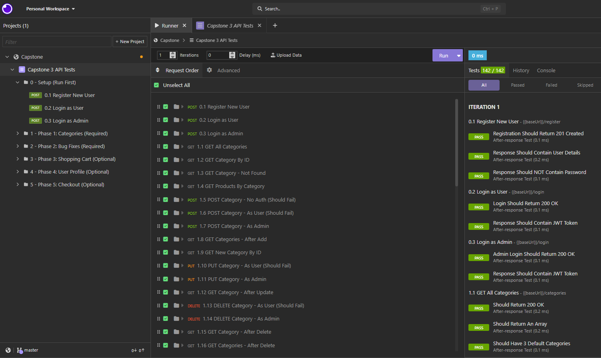

# Capstone 3: The Easy Shop API Server

## 📌 Project Overview
For my final capstone project completing a 12-week intensive coding bootcamp, I chose to power **The Easy Shop** e-commerce platform. The primary objective of this project was to implement a robust, layered Spring Boot architecture to resolve critical existing application bugs and build out custom backend features designed to elevate the user experience.

All backend code changes were thoroughly tested via endpoint requests in **Insomnia** and verified by tracking data states directly inside **MySQL Workbench**.

---

##  Architecture & Tech Stack
To ensure the business logic remains clean, organized, and highly maintainable, the project strictly adheres to a **Layered Architecture** requirement:

*   **Model:** Defines the database entities and maps data structures.
*   **Repository (`@Repository`):** Communicates directly with the database using Spring Data JPA.
*   **Service (`@Service`):** Houses the core business logic and transactional validations.
*   **Controller (`@RestController`):** Handles incoming HTTP routes, requests, responses, and API security.

### Key Skills Utilized:
*   **Languages & Frameworks:** Java, Spring Boot
*   **Security & Data:** Spring Security (JWT), Spring Data JPA, MySQL
*   **Testing Tools:** Insomnia

---

## Application Screens
Below is a screenshot demonstrating a successful API request executed through Insomnia. This test highlights the utilization of secure Bearer Tokens (JWT) to guarantee protected database access and safe user experiences:



---

## 🚀 Technical Challenges & Highlights
One of the most engaging and challenging milestones of this project was configuring the **Optional Phase 4: User Profile Pipeline** using Spring Security. Specifically, leveraging the `Principal` security interface layer allowed me to extract individual user credentials from bearer tokens safely so clients can view and modify their profile tables securely.

### Profile Retrieval Implementation:
```java
@GetMapping("")
public ResponseEntity<Profile> getProfile(Principal principal) {
    if (principal == null) {
        throw new ResponseStatusException(HttpStatus.UNAUTHORIZED, "Oops! You must log in first.");
    }
    String userName = principal.getName();
    User user = userService.getByUserName(userName);
    int userId = user.getId();
    Profile currentProfile = profileService.getProfileById(userId);

    return ResponseEntity.ok(currentProfile);
}